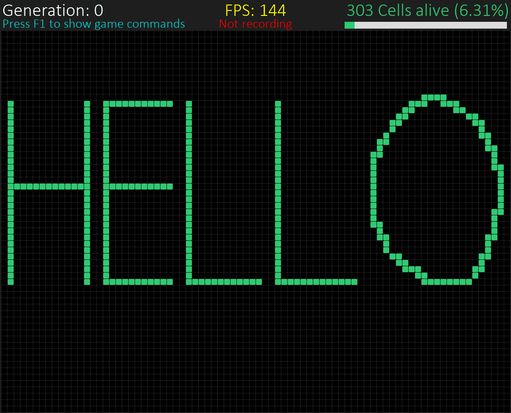

# Abalone_Pygame
John Horton Conway's Game of Life using a 2D Cellular Automata (CA) grid with the associated standard transition rules:

- A living cell with fewer than 2 living neighbours dies
- A living cell with 2 or 3 living neighbours stays alive
- A living cell with more than 3 living cell dies (overpopulation)
- A dead cell with exactly 3 living cells becomes alive

Shortkeys:

| Shortkey | Description |
| --- | --- |
| Spacebar | Pause/unpause the game |
| F1 | Show/hide command menu |
| F2 | Take a snapshot of the current grid |
| F3 | Enable/disable recording |
| p  | Reset grid (all cells beccome dead) |
| Left/right click | Kill/give birth to a cell |
| Shift + left/right click | Multiple kills/births |

Further additions:

- Buttons to add popular patterns (glider, Gosper glider gun, etc.)
- Grid size editing
- Environment editing (Moore or von Neumann, current is Moore)
- Transition rules edigint (current are the standard ones, see above)

For more general informations: 

[Cellular Automata](https://en.wikipedia.org/wiki/Cellular_automaton)\
[John Horton Conway's Game of Life](https://en.wikipedia.org/wiki/Conway%27s_Game_of_Life)

Note: GIFs upload seem to visually disrupt the regularity of the 2D CA grid.

